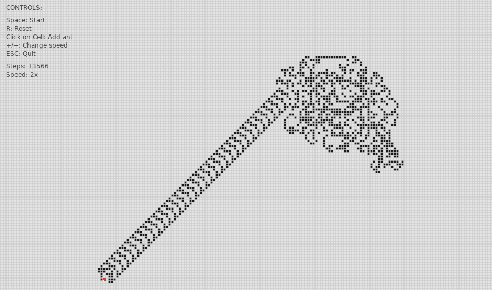
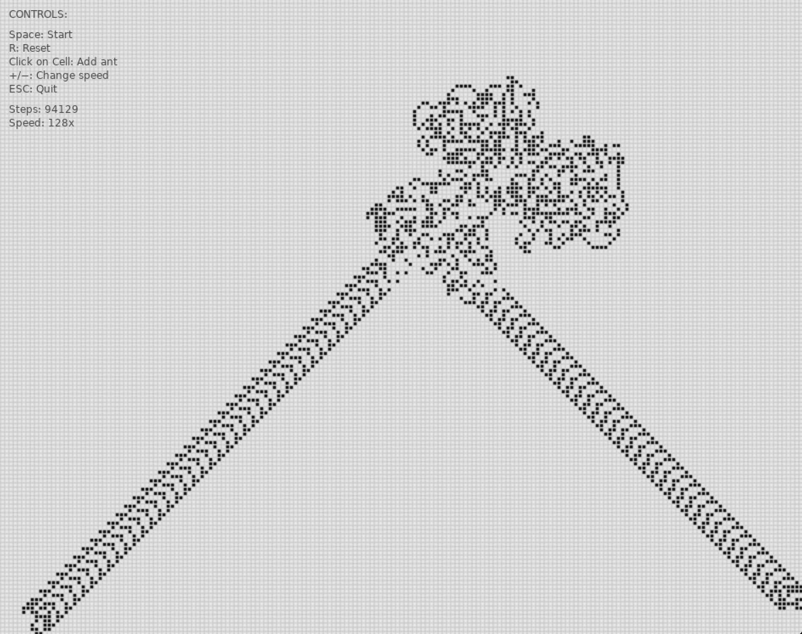

# Langton's Ant 

This repository contains the source code for my implementation of _Langton's Ant_, a theoretical “ant” that moves on an infinite 2D grid of square cells. Each cell can be in one of two states: white, or black.

## Rules for the Ant's Movement
The rules are very simple: The user is prompted to pick a starting point for the ant on the grid. From there, the ant can start its traversal across the grid using the following mechanisms:
- Looking at the color of the cell it is on
- If the cell is white:
    - Turn right
    - Flip the current cell to black
    - Move forward one square
- If the cell is black:
    - Turn left
    - Flip the current cell to white
    - Move forward one square

## Outcomes
Despite these simple, deterministic rules, the system goes through three distinct phases:
1. We observe **initial chaos** where the ant produces seemingly random, irregular patterns.
2. **Emergent order** appears after a few thousand steps. Structured patterns begin to appear at this stage.
3. The appearance of **the “highway”**. Eventually, the ant settles into a repeating pattern and builds an infinite diagonal “highway,” moving away forever in a predictable direction.

This transition from chaos to order is what makes Langton’s Ant famous.



## Significance
### [1] Emergence
_Emergence_ means that some global structure appears despite the fact that each component follows very simple, local rules, and that there is no central control or a part that “knows” the overall pattern. In this algorithm, the ant only sees one square at a time without memorizing any of its previous moves (*). The grid itself also has no built-in structure.

Despite all of that, the ant eventually emerges from apparent randomness into a highly structured, repeating highway. The highway is _not_ hardcoded anywhere in this repository; it emerges from repeated local interactions.

> _(*) You can contrast this with Conway's _Game of Life_, where, unlike Langton's ant, the life updates all cells in parallel. The ant, on the other hand, updates each cell sequentially._

### [2] Deterministic Chaos (Unpredictability Without Randomness)
Langton's ant is fully deterministic. For a fixed starting state, it always yields the same outcome... However, small changes in initial conditions (such as the ant's starting cell or its orientation) lead to dramatically different early trajectories, which is what we refer to as "deterministic chaos" (*). While the system is not random, it is computationally unpredictable for long periods of time.

> _(*) Deterministic Chaos refers to chaos-like behavior in a deterministic system._

### [3] Turing Completeness (Computational Universality)
A system is said to be Turing-complete if it can simulate any computation when given enough time and space. Langton’s original ant is not proven to be Turing-complete, but variants are (*).

> _(*) Researchers have shown that, by modifying rules or initial configurations, you can build wires, memory, or logic gates using only ant motions and cell states. In other words, a "toy ant" on a grid can simulate a full computer. This means that computation is not tied exclusively to conventional digital machines, but that even simple physical systems can compute... This connects to DNA computing, chemical reaction networks, quantum and biological computation, etc. In other words, computation is an emergent property of rule-based systems, not just machines._

## About this Repository
### Controls
This implementation allows the user to see how Langton's ant behaves on a grid, follow its movements, and observe the emergent patterns it creates over time. The user can also add multiple ants on the grid to explore how their interactions create complex behaviors, and how that affects the overall system dynamics.



I also ended up observing [this odd, recursive pattern](https://youtu.be/EcnEnaLu0ZA).

### Installation Instructions
- If you'd like to run this project locally, make sure you first have the [Lua](https://www.lua.org/download.html) programming language and the [LÖVE2D](https://love2d.org/) game engine installed locally.
- Then, clone this repository, ```cd``` into the project, and run ```love .``` in the terminal to run the simulation.

### Directory Structure
```
langtons-ant/
├── components/  
│   ├── ant.lua             # ant movement logic
│   ├── grid.lua            # grid component
│   └── welcome.lua         # home page component
│
├── images/                 # screenshots of grid and ants
├── sounds/                 # sound effects
│
├── docs/
│   └── implementation.md   # implementation details
│
├── main.lua                # init main simulation loop
├── conf.lua                # pop-up page configs
├── .gitignore              # ignore editor configs
│ 
├── LICENSE
└── README.md
```
